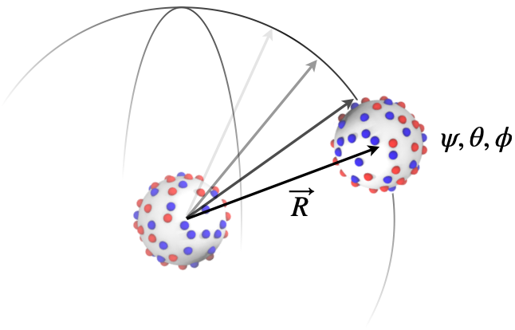

<p align="center">
  
</p>
<p align="center">
    <a href="https://doi.org/10/p5d4">
        
    </a>
    <a href="https://doi.org/10.5281/zenodo.15772003">
        
    </a>
    <a href="https://colab.research.google.com/github/mlund/duello/blob/master/scripts/colab.ipynb">
        
    </a>
    <a href="https://opensource.org/licenses/Apache-2.0">
        
    </a>
    <a href="https://github.com/mlund/duello/actions/workflows/rust.yml">
        
    </a>
</p>

-----

<p align = "center">
<b>Duello</b></br>
<i>Virial Coefficient and Dissociation Constant Estimation for Rigid Macromolecules</i>
</p>

-----

# Introduction

Duello is a tool to calculate the potential of mean force (PMF) between two rigid bodies, performing a
statistical mechanical average over inter-molecular orientations using subdivided icosahedrons.
For each mass center separation, _R_, the static contribution to the partition function,
$\mathcal{Z}(R) = \sum_{\mathbf{\Omega}} e^{-V(R,\mathbf{\Omega})/k_BT}$, is explicitly
evaluated to obtain the potential of mean force,
$w(R) = -k_BT \ln \mathcal{Z}(R)$
and the thermally averaged energy,

$$
U(R) = \frac{\sum V(R,\mathbf{\Omega}) e^{-V(R,\mathbf{\Omega})/k_BT}} {\mathcal{Z}(R)}
$$

where $V(R,\mathbf{\Omega})$ is the total inter-body interaction energy and $\mathbf{\Omega}$ represents a 5D angular space (_e.g._ two spherical coordinates for each body plus a dihedral angle around the connection line).

The osmotic second virial coefficient, which has dimensions of _volume_, reports on exactly two-body interactions:

$$
\begin{align}
B_2 & = -\frac{1}{16\pi^2} \int_{\mathbf{\Omega}} \int_0^{\infty}
\left (
  e^{-V(R,\mathbf{\Omega})/k_BT} - 1
\right )
R^2 dR d\mathbf{\Omega}\\
& =  -2\pi \int_0^{\infty} \left ( e^{-w(R)/k_BT} -1 \right )R^2 dR \\
& = B_2^{hs} -2\pi \int_{\sigma}^{\infty} \left ( e^{-w(R)/k_BT} -1 \right )R^2 dR\\
\end{align}
$$

where $B_2^{hs} = 2\pi\sigma^3/3$ is the hard-sphere contribution and $\sigma$ is a distance
of closest approach where $w(R\lt \sigma)=\infty$ is assumed.
For systems with net attractive interactions, the dissociation constant, $K_d$, can be estimated by,

$$
K_d^{-1} = 2 N_A\left (B_2^{hs} - B_2\right )
$$

<p align="center">
  
</p>

# Installation

Binary packages are available for Linux and MacOS through PyPI.org:

```console
pip install duello
```

If you have a [Rust toolchain](https://www.rust-lang.org/learn/get-started) installed,
you may alternatively build and install directly from the source code:

```sh
cargo install --git https://github.com/mlund/duello
```

# Usage

The command-line tool `duello` does the 6D scanning and calculates
the angularly averaged potential of mean force, _A(R)_ which
is used to derive the 2nd virial coefficient and twobody dissociation constant, $K_d$.
The two input structures should be in `.xyz` format and all particle names must
be defined in the topology file under `atoms`.
The topology also defines the particular pair-potential to use, see below.
Note that currently, a coulomb potential is automatically added and should
hence _not_ be specified in the topology.

```sh
duello scan \
    --mol1 cppm-p18.xyz \
    --mol2 cppm-p18.xyz \
    --rmin 37 --rmax 50 --dr 0.5 \
    --top topology.yaml \
    --resolution 0.8 \
    --cutoff 1000 \
    --molarity 0.05 \
    --temperature 298.15 \
    --backend auto \
    --grid "type=powerlaw2,size=2000,shift=true"
```

## Spline Grid Options

The `--grid` option controls interpolation of pair potentials:

| Key     | Values               | Default     | Description                              |
|---------|----------------------|-------------|------------------------------------------|
| `type`  | `powerlaw2`, `invr2` | `powerlaw2` | Grid spacing (invr2 avoids sqrt in eval) |
| `size`  | integer              | `2000`      | Number of grid points                    |
| `shift` | `true`, `false`      | `true`      | Shift energy to zero at cutoff           |

Example: `--grid "type=invr2,size=1500,shift=false"`

## Backend Performance

The program is written in Rust and attempts to use either GPU or all available CPU cores.
The following backends are available, with performance measured on the Calvados3 lysozyme example
(2.4M poses, 128 atoms per molecule, Apple M4):

| Backend     | Description                    | Poses/ms | Speedup |
|-------------|--------------------------------|----------|---------|
| `reference` | Exact potentials (validation)  |       48 |    1.0x |
| `cpu`       | Splined potentials             |      102 |    2.1x |
| `simd`      | NEON (aarch64) / AVX2 (x86)    |      131 |    2.7x |
| `gpu`       | wgpu compute shaders           |     1065 |     22x |

The `auto` backend (default) selects GPU if available, otherwise SIMD.
All but `reference` use Cubic Hermite splines for pair potentials.

## Preparing PDB files

The following uses `pdb2xyz` to create a coarse grained XYZ file and Calvados topology for Duello:

```sh
pip install pdb2xyz
pdb2xyz -i 4lzt.pdb -o 4lzt.xyz --pH 7.0 --sidechains
duello scan \
  -1 4lzt.xyz -2 4lzt.xyz \
  --rmin 24 --rmax 80 --dr 0.5 \
  --resolution 0.6 \
  --top topology.yaml \
  --molarity 0.05
```

If `pdb2xyz` give errors, you may be able to correct your PDB file with
[pdbfixer](https://github.com/openmm/pdbfixer?tab=readme-ov-file).

## Examples

Ready run scripts examples are provided in the `scripts/` directory:

Command                | Description
---------------------- | ------------------------------------------------------------
`scripts/cppm.sh`      | Spherical, multipolar particles using the CPPM model
`scripts/calvados3.sh` | Two coarse grained lysozyme molecules w. Calvados3 interactions


## Interaction models

Each macromolecule is represented by a rigid constellation of beads with
properties defined under `atoms` in the topology file.
The inter-molecular energy, $V(R,\Omega)$ is calculated by summing all pairwise interactions
between beads using a customizable pair potential, $u_{ij}$.
If needed, different pair-potentials can be explicitly defined for
specific atom pairs.

The provided examples illustrate the following schemes:

- Screened `Coulomb` + `AshbaughHatch`, for the Calvados model.
- Screened `Coulomb` + `WeeksChandlerAndersen` for the CPPM model.

Many more pair-potentials are available through the
[`interatomic`](https://docs.rs/interatomic/latest/interatomic/twobody/index.html) library,
_e.g._ `LennardJones`, `HardSphere` etc.

__Warning:__ The electrostatic term, `Coulomb` is
always automatically added and should therefore _not_ be specified in the topology.

# Development

This is for development purposes only and details how to create and publish a
binary package on pipy.org.

## Create `pip` package using Maturin via a Docker image:

Run this on MacOS, linux (x86 and arm) to get all architectures:

```sh
docker run --rm -v $(pwd):/io ghcr.io/pyo3/maturin::v1.11.5 publish -u __token__ -p PYPI_TOKEN
```


For local Maturin installs, follow the steps below.

```sh
pip install ziglang pipx
pipx install maturin # on ubuntu; then restart shell
maturin publish -u __token__ -p PYPI_TOKEN --target=x86_64-unknown-linux-gnu --zig
```

MacOS targets can be generated without `--zig` using the targets
`x86_64-apple-darwin` and `aarch64-apple-darwin`.

```sh
rustup target list
rustup target add x86_64-apple-darwin
```

